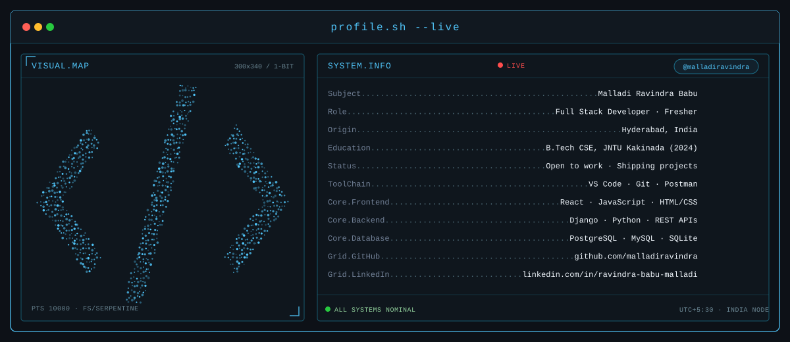

<!-- PROFILE TERMINAL BANNER -->

  

<!-- SOCIAL NAVIGATION -->

  
  &nbsp;
  <!-- No verified Instagram account found in the repo. Replace href="#" with your real profile URL. -->
  
  &nbsp;
  <!-- No verified X/Twitter account found in the repo. Replace href="#" with your real profile URL. -->
  

<!-- PROFILE VIEWS -->

  

---

### 🚀 About Me

- 🎓 Full Stack Developer with hands-on internship experience building complete applications across the stack — Django/DRF backends and React frontends
- 🛠️ Comfortable owning a feature end-to-end: REST API design, PostgreSQL schema optimization, JWT authentication, and React UI development, including real-time features with WebSockets and Celery
- 🏗️ Independently architected a full-stack budgeting platform with a React 19 + TypeScript frontend and automated Playwright test coverage
- 💼 Seeking a **Full Stack Developer** role to build and ship user-facing features on both ends of the stack
- 📫 Reach me at **malladiravindra1@gmail.com**

---

### 🧰 Tech Stack

**Languages**

**Backend**

**Frontend**

**Databases**

**Real-Time & Async**

**Testing & QA**

**Tools**

---

### 🌟 Featured Projects

**[Budget Management Platform](https://github.com/malladiravindra)**
Decoupled full-stack budgeting platform with a React 19 + TypeScript frontend and a Django REST Framework backend. Features a drag-and-drop Kanban UI, real-time WebSocket time tracking, Celery-driven background tasks, Excel/PDF financial reporting, and a Profit Margin KPI dashboard with role-based access control.
`Django REST Framework` `React 19` `TypeScript` `PostgreSQL` `WebSockets` `Celery` `Redis`

**[Automated Testing Suite (Playwright)](https://github.com/malladiravindra)**
Migrated an E2E test suite from Selenium to Playwright using the Page Object Model, with automated RBAC and WebSocket coverage via Django Channels' `WebsocketCommunicator`, integrated into a CI pipeline with Postgres/Redis service containers.
`Playwright` `Django Channels` `GitHub Actions` `Factory Boy`

**[Automatic YouTube Scripting Tool](https://github.com/malladiravindra)**
Python automation framework that reduced manual content-creation effort by 60%, saving 15+ hours per week, with OAuth 2.0 authentication and rate-limited API usage.
`Python` `YouTube Data API v3` `OAuth 2.0`

**[LinkedIn Clone UI](https://github.com/malladiravindra)**
Responsive LinkedIn-style UI in Angular with profile management, a social feed, connections, and messaging interfaces built from reusable components.
`Angular` `TypeScript` `Angular Material` `RxJS`

---

### 📊 GitHub Stats

  
  

  

---

### 🎓 Education

**B.Tech, Computer Science & Engineering** — Vikas Group of Institutions, JNTU Kakinada (2020 – 2024)

---

  <em>Open to Full Stack Developer, Django Developer, and Python Developer roles.</em>

